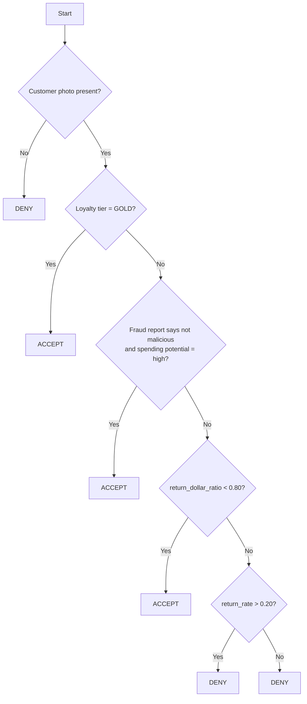

# The Return Desk

A speed/accuracy game that demonstrates why higher levels of agentic engineering beat manual work.

## Quick Start

```bash
pip install -r requirements.txt
uvicorn server:app --host 0.0.0.0 --port 8888
```

Open `http://localhost:8888` to play.

## Mode

- Every run is a timed solo run.
- All completed solo runs feed a persistent Hall of Fame leaderboard.
- Each run also gets its own secret `agent token` so only the owning browser or trusted agents can act on that session.

Each session gets its own timer. The 20-minute clock starts when that session loads its first customer, not when the server starts.

## How to Play

You're a return desk agent. For each customer, you receive 3 files:

1. `Receipt (PDF)` - Check whether a customer photo is included.
2. `Transactions (Excel)` - Calculate the return rate and dollar ratio.
3. `Fraud Report (PowerPoint)` - Find the assessment slide.

Based on these files, decide `ACCEPT` or `DENY`.

## Briefing

What is happening:

- Customers arrive at the return desk one at a time.
- Each one comes with a receipt PDF, a transaction spreadsheet, and a fraud report deck.

What needs to be done:

- Read the decision rules below, then decide `ACCEPT` or `DENY` for each customer before time runs out.
- Use the receipt PDF, transaction spreadsheet, and fraud report deck to evaluate each case.
- If you want to apply Rule 2, fetch the customer's loyalty tier from BigQuery by `customer_id` via Gestalt.
- Move fast, but follow the rule order exactly because the first matching rule wins.

## Decision Rules

Evaluate in order. Stop at the first rule that triggers.

Definitions:

- `return_rate = returned transactions / purchase transactions`
- `return_dollar_ratio = total return dollars / total purchase dollars`

Named rules:

| Rule | Condition | Decision |
|------|-----------|----------|
| 1 - Photo Gate | Receipt has NO customer photo | DENY |
| 2 - Loyalty Override | Loyalty tier is `GOLD` | ACCEPT |
| 3 - Fraud Override | Fraud = `not malicious` AND spending = `high` | ACCEPT |
| 4 - Low-Dollar Accept | `return_dollar_ratio < 0.80` | ACCEPT |
| 5 - High-Rate Deny | `return_rate > 0.20` | DENY |
| 6 - Default Deny | None of the above | DENY |

Canonical decision order:

1. If the receipt does not contain a customer photo, `DENY`.
2. Else if the customer's loyalty tier is `GOLD`, `ACCEPT`.
3. Else if the fraud report says `not malicious` and spending potential is `high`, `ACCEPT`.
4. Else if `return_dollar_ratio < 0.80`, `ACCEPT`.
5. Else if `return_rate > 0.20`, `DENY`.
6. Else `DENY`.

Notes for agent builders:

- Stop at the first matching rule.
- Rule order matters more than anything else.
- Loyalty tier is not present in the 3 customer files. If you want Rule 2, you need a separate lookup by `customer_id`.

```sql
SELECT loyalty_tier
FROM prod-peach-street.analytics_poc.return_desk_customers
WHERE customer_id = '...'
```

Decision flow:



## Scoring

`score = correct_decisions * (100 / avg_seconds_per_decision)`

Both speed and accuracy matter.

## API

```text
POST /api/session              - Create a session and return { session_id, agent_token }
GET  /api/session/{id}         - Session stats, mode, state, time remaining
GET  /api/session/{id}/next    - Get next customer + file URLs
POST /api/session/{id}/decide  - Submit { "customer_id": "...", "decision": "ACCEPT"|"DENY" }
GET  /api/leaderboard          - Hall of Fame rankings for solo runs
GET  /api/rules                - Decision rules text
GET  /api/status               - App defaults and aggregate session counts
POST /api/admin/reset          - Reset sessions; optionally regenerate customers
```

Session creation accepts:

```json
{
  "name": "Grant"
}
```

Example response:

```json
{
  "session_id": "7f4afdfe",
  "name": "Grant",
  "agent_token": "paste-this-into-your-agent"
}
```

Every session-specific API request must include either:

```text
X-Session-Token: <agent_token>
```

or:

```text
Authorization: Bearer <agent_token>
```

Example:

```bash
BASE="http://localhost:8888"
SID="7f4afdfe"
TOKEN="paste-this-into-your-agent"

curl -s \
  -H "X-Session-Token: $TOKEN" \
  "$BASE/api/session/$SID/next"
```

## Data Loading

The server now prefers loading pre-generated customer profiles from `generated/` instead of regenerating the full dataset on startup. If no generated customers exist, it falls back to generation.

For Vercel builds, `build.py` generates the dataset during the build if `generated/` is absent. `vercel.json` deploys the root [server.py](/Users/grantlee/Desktop/agentic-game/server.py) ASGI app directly and explicitly includes the generated/static files in the bundle.

## Storage Backends

- Local development uses a JSON file at `.data/session_store.json`.
- Vercel uses Upstash/Vercel Redis automatically if either of these env var pairs is present:
  - `UPSTASH_REDIS_REST_URL` + `UPSTASH_REDIS_REST_TOKEN`
  - `KV_REST_API_URL` + `KV_REST_API_TOKEN`
- On Vercel, Redis is required by default. If it is missing, the app now fails fast instead of silently using non-durable storage.
- For one-off testing only, you can opt into ephemeral Vercel storage with `ALLOW_EPHEMERAL_SESSION_STORE=1`, but that uses `/tmp` and is not durable across cold starts or instances.

Session updates are atomic through the storage layer so browser + bot traffic does not corrupt the same run.

## Deploying To Vercel

1. Create an Upstash Redis database from the Vercel Marketplace, or otherwise provide the Redis REST URL/token env vars above.
2. Optionally set `ADMIN_CODE`, `CUSTOMER_COUNT`, `GAME_DURATION`, and `SESSION_STORE_NAMESPACE`.
3. Deploy the repo to Vercel. The build script will generate customer files if they are not already present.
4. For the long-term setup, keep preview deployments protected in Vercel, but let the production game URL be public. Session access is protected in-app by per-run agent tokens instead of Vercel Authentication.

Notes:

- This app still serves game files from the Python function bundle. The current generated corpus is small enough for that, but if you grow the asset set significantly you should move those files to Blob or object storage.
- Local persistence is only meant for development. Shared production state should use Redis on Vercel.
- Anyone with a session's `agent token` can act on that run, so treat it like a credential and only share it with agents you trust.
